# Maptime Boston’s Cartographic Design Tips

This is a whirlwind tour of some basic cartographic design topics. For lots more information and practical resouces to go along with these, look at [resources.md](resources.md) in this repository.

## What is a map?

Silly question, right? No! Think about the _what_ and _why_ of maps.

A map is a *representation* of a place. It is a symbolic interpretation of place and highlights the relationships between elements in space, either perceived or actual. It reflects choices and biases of the mapmaker. It does not and cannot represent _everything_ in the place. Things must be omitted, simplified, etc. for the map to make sense.

Maps can be divided into two broad categories: _reference_ and _thematic_. 

*Reference maps* emphasize the *location* of spatial phenomena, e.g. topographic maps or road maps.  

*Thematic maps* emphasize the *spatial pattern* of geographic attributes, e.g. population density or income. Thematic maps come in a variety of flavors, including:

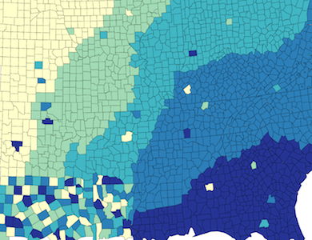  
_Choropleth_ maps in which *areas* are shaded by **color** to represent values. Choropleth maps are perhaps the most common and familiar type of thematic map, frequently seen for demographic or political data.

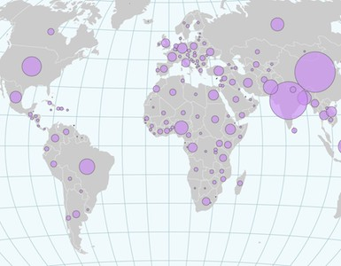  
_Proportional symbol_ maps, in which symbols (such a circles) are scaled in proportion to the data they represent. Symbols might represent point data, but it is also common for proportional symbols to be used for area features.

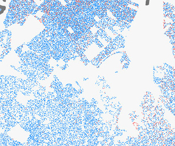  
_Dot_ maps, which use points to represent counts of a geographic phenomenon. Dot density maps rely on visual scatter to show spatial pattern. Dot maps may have a one-to-one relationship, in which one dot represents a single instance of something (e.g. one dot per vote), or a one-to-many relationship in which each dot represents a certain quantity of something.

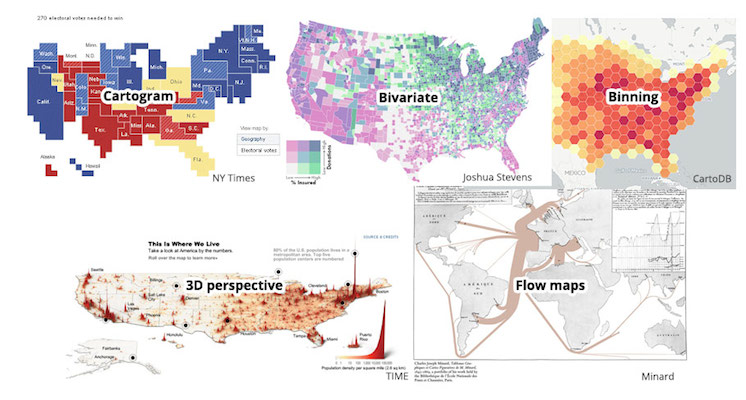  
...and many other types! These notes are mostly about general map design topics rather than specific types of maps, but see the [resources](resources.md) list for more about some types of thematic maps.

## Do you need a map? Does it need to be interactive?

It’s always good to ask whether your data or story even has a spatial component. If geography is not important, a map is probably not the best way to show it. Additionally, if you’re working on the web, think about how much your map benefits from interactivity, if at all. Just because you _can_ add interaction and more data doesn’t mean you _should_—it requires a lot more design work from you, and potential difficulty for your audience.

## Visual variables

Visual variables are the basic ways in which graphical marks vary. Some allow quick visual grouping of symbols: for example symbols are easily grouped by _hue_, but not _shape_. Some are perceived as naturally ordered, such as size and value (lightness). Does the data you’re mapping have order (or quanitity)? Are there groups that should stand out? Be mindful of the appropriate visual variables to use in your symbolization.

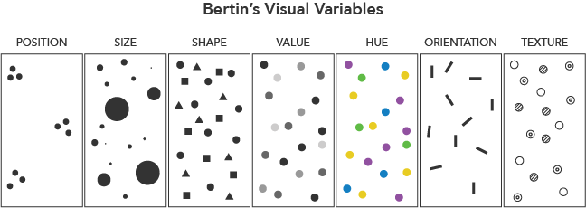  
_The seven “retinal variables” proposed by Jacques Bertin in_ Semiology of Graphics _(1967). Later cartographic researchers have expanded the list._

## Visual hierarchy

Good _visual hierarchy_ is crucial to overall effective map design. Visual hierarchy is the organization of design such that some things seem more prominent and important, and others less so. Visual hierarchy should match _intellectual_ hierarchy—what are the most important things in your map, conceptually? Those should stand out. Visual hiearchy depends on _figure-ground relationships_. Figures are the things that stand out; ground is the rest. (Think foreground and background.) Contrast is the key. In general, larger and darker things appear as figure.

Try the _squint test_. If you stand back or squint to blur your map, do the key components still stand out?

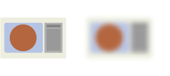

## Color

Color is an important component of good map design, and while true mastery of color takes a designer’s eye and experience, there are some general guidelines to start with:
- Keep in mind cartographic conventions you’ve seen: blue for water, etc.
- Avoid red–green color schemes, as a significant population is colorblind and can’t discern these.
- Think about whether your colors imply relationships, and whether relationships actually exist in what you’re mapping. If two things are not related, it may be best to color them with different hues.
- Subtlety is usually your friend! Save any bold colors for important things in your hierarchy.

For choropleth mapping, use color ramps appropriate to the nature of your data. 
If there is no natural order of your data classes, use a _qualitative_ color scheme.
If the data have order in one direction, use a _sequential_ color scheme. (Definitely NOT a rainbow scheme!)
If the data have order and can be divided above and below some meaningful breakpoint, use a _diverging_ color scheme.

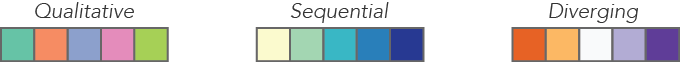

## Classifying and normalizing data

Most choropleth maps use a classification scheme to group data values into bins, ideally 3–7 of them. This can make it easier to read the map—but different classification methods can produce vastly different looking maps. They all have their advantages and drawbacks. Try to use one that is both understandable and clarifies real patterns in the data. A few common methods:
- Equal interval: divide data into groups of equal value ranges
- Quantiles: put the same number of data observations in each class
- Natural or Optimal breaks: find natural groupings, maximizing similarity within groups and differences between groups

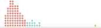  
_Equal interval with four classes. No values at all in the third class!_

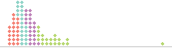  
_Quantiles. Does that outlier at the end really belong with the other green dots?_

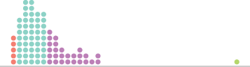  
_Hypothetical natural breaks. Looks good but can be hard to understand._

Choropleth maps should also be normalized, that is, some kind of ratio rather than raw counts of things. Otherwise you just get http://xkcd.com/1138/. For example, population _density_ or GDP _per capita_ are more meaningful than just population or total GDP.

## Map projections

Displaying a round earth on a flat map, i.e., projecting the map, requires distortions. Map projections can accurately maintain local angles (shape, more or less), sizes, directions, or distance—but never all of them. From a design perspective, think about a few things:
- Is the projection appropriate for the type of map and the map's purpose?
- What is the area covered by the map?
- Does the map projection look decent, with geography looking recognizable?

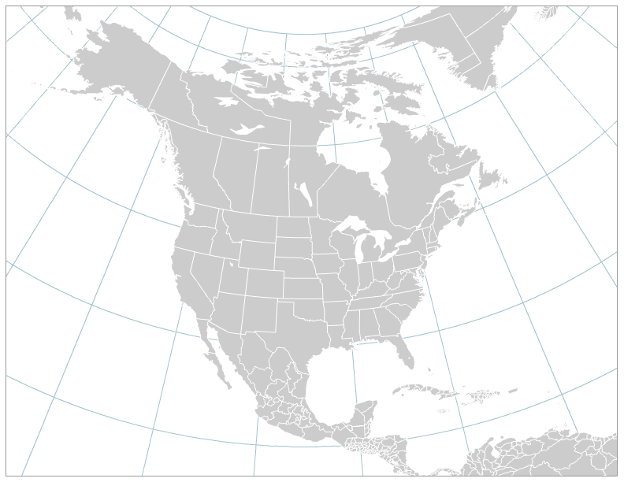  
_Choropleth and dot density maps should use equal-area projections, such as Albers Equal Area Conic for continent-level maps or Mollweide for world maps, so that size distortions don't lead us to misinterpret data values._

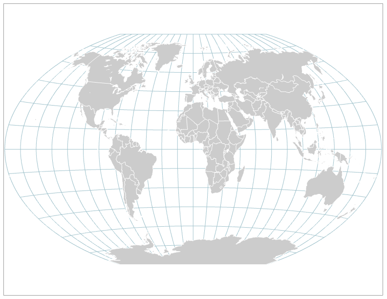  
_Compromise projections such as Winkel Tripel or Robinson were developed mainly to produce a familiar, not wildly distorted appearance. They preserve no properties perfectly but generally look good for world maps._

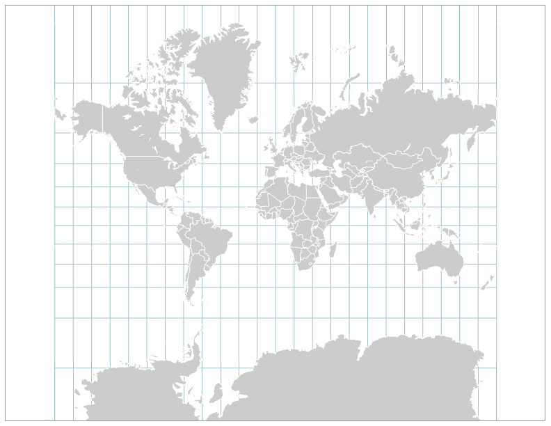  
_The widespread Mercator projection (seen in most web maps) preserves local directions but badly distorts sizes at global scale. It's good for navigating in a city or sailing across the ocea, but it is not ideal for thematic maps._

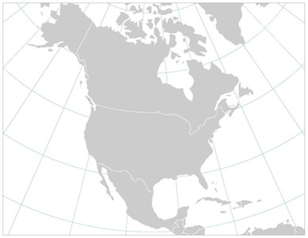  
_Lambert Conformal Conic is a popular projection for North America and other areas of similar east-west extent. It preserves shape in a sense and generally looks "right" and familiar._

## Text and labels

Type can convey information through words, but characteristics of type can also communicate meaning. Type on maps is found not only in labels, but also in supplemental information, such as legends and sources, and in blocks of prose. Do not take typography for granted! Your choices of typeface, style, etc. can have a strong impact on the clarity, meaning, and tone of the map.
- _Be consistent._ A good rule of thumb is to choose two fonts: one serif font, and one sans-serif.
- Encode information in different weights and styles (bold, italic, regular, light, etc.).
- Use principles of your _visual and intellectual hierarchy_ with text. Make important things bolder and bigger, and less important things smaller and lighter (or even, off the map!).
- A convention is to label physical features (water bodies, for example) with a serif font. Water labels are often italicized.

  
_Hypothetical label styles and hierarchy. Labels for large areas often use increased letter spacing (tracking)._ 

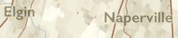  
_Masking or halos around labels can improve legibility against background features. ([Map example](https://somethingaboutmaps.wordpress.com/2015/09/28/a-matter-of-perspective/) by Daniel Huffman.)_

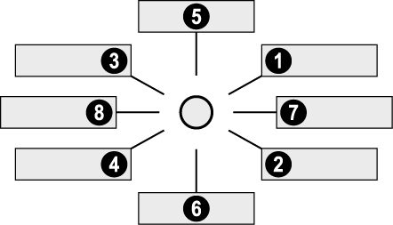  
_Order of preference for label placement on point features. ([source](http://www.svgopen.org/2002/papers/dahinden__good_map_graphics/))_

## Scale and generalization

At its core, cartography is about _abstraction_. We don’t show data in its raw form; we clarify it in a variety of ways, often by removing things. A big reason is _scale_, that is, the size of the map compared to the size of the real world. It simply isn’t possible to show every tiny detail! Data and graphics should be _generalized_ appropriately to the map scale: at a large scale (”zoomed in”) you can have more detail. Typical generalization operations include:

  
_Selection:_ choosing which objects to include on the map

  
_Simplification:_ reduce the number of vertices in an object

  
_Smoothing:_ reduce sharp angles to smoother curves

  
_Aggregation:_ group points into areas

  
_Amalgamation:_ group areas into larger areas

  
_Collapse:_ reduce a detailed object to a point symbol

  
_Merge:_ grouping of line features

  
_Refinement:_ select only portions of an object to display

  
_Exaggeration:_ amplify a part of an object

  
_Enhancement:_ add detail that visually elevates an object

  
_Displacement:_ increase separation between objects

## Further resources!

Many links to in-depth information and practical tools related to all these topics are in [resources.md](resources.md)!